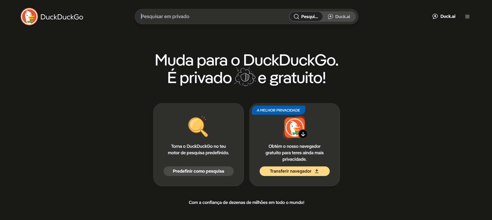
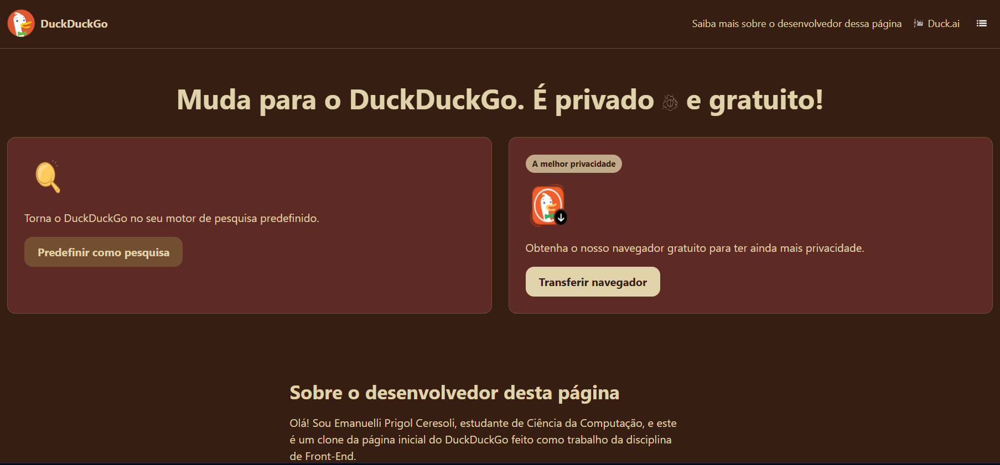
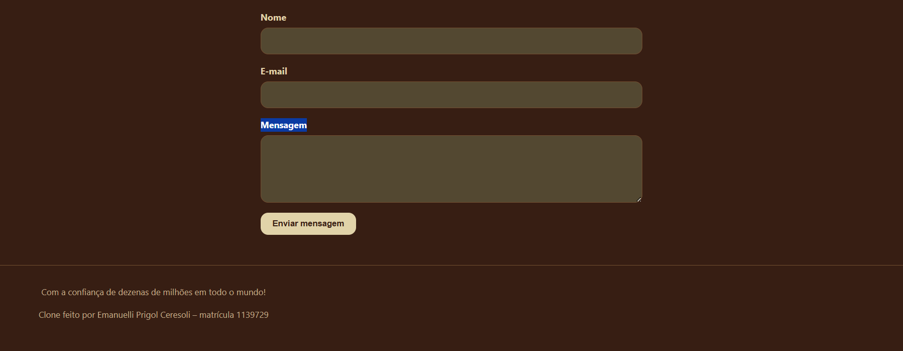

RA: 1139729
ALUNA: Emanuelli Prigol Ceresoli
SITE USADO: Navegador DuckDuckGo!
PROFESSOR: Matheus Henrique Barquette

Este repositório contém um clone da página inicial do DuckDuckGo, desenvolvido como trabalho da disciplina [nome da disciplina]. O objetivo é reproduzir a estrutura, as proporções e o layout da página original usando HTML semântico e CSS, com uma paleta de cores própria (tema escuro, tons terrosos) no lugar da paleta original.

- A barra de pesquisa do cabeçalho foi substituída por um link "Saiba mais sobre o desenvolvedor dessa página", que leva a uma seção com apresentação e formulário de contato.
- A paleta de cores é diferente da original, para não ser uma réplica visual completa do site.

## Andamento

- **Dia 1:** README inicial criado, com identificação, link de referência e checklist.
- **Dia 2:** Estrutura inicial do HTML: head com metadados e início do header com o logo.

- Ajustes de conteúdo e revisão da estrutura do `index.html`.
  - Adicionada a imagem real do logo (`img/logo.png`), substituindo o placeholder.
  - Preenchido o texto de apresentação da seção "Sobre o desenvolvedor desta página"
    com informações reais (nome, curso e objetivo do clone), no lugar do texto provisório.
  - Conferido, por meio de teste no navegador sem CSS, que a ordem semântica do HTML
    está correta: logo → nav → título → cards → seção do desenvolvedor com formulário → rodapé.
    Isso confirma que a estrutura (critério 1.1) está pronta antes de iniciar o CSS.
  - Identificadas as imagens que ainda faltam adicionar: `lupa.png`, `navegador.png`,
    `duck-ai.svg` e `escudo.svg`. Definido o tamanho de referência de cada uma
    (ícones pequenos como SVG, ícones de card em ~128×128 px para telas retina).

  - **Dia 3:** definição de todas as variáveis do projeto no bloco :root.
Paleta de cores: 8 cores base extraídas de uma paleta terrosa (Coffee 
#371e13, Maroon 
#5e2a25, Clay Dust 
#c0aa8a, Creme 
#e1d3a9, Leather Couch 
#734f31, Deep Peach 
#a85530, Guave 
#8f7c3a, River Pine 
#534831), escolhida para um tema escuro que substitui a paleta original do DuckDuckGo (item de personalização visual, já que o professor pediu que a aparência não fosse uma réplica do site de referência).
Papéis atribuídos a cada cor: cada variável de cor base foi associada a uma função na página (fundo, texto principal, texto secundário, fundo dos cards, bordas, botões primário e secundário, selo, campos de formulário, foco de teclado), para que trocar a paleta inteira no futuro exija mexer só nesse bloco.
Antes de decidir os papéis, foi feito um cálculo de contraste (WCAG) entre as cores da paleta, para garantir texto legível sobre os fundos escolhidos e evitar problemas de acessibilidade.
Variáveis de tipografia e espaçamento: fonte base (pilha de fontes do sistema, system-ui), raio de borda padrão para cards e botões (12px) e espaçamento padrão entre seções (3rem), centralizando esses valores para reutilização em todo o CSS.
Corrigido também um problema de nome de arquivo: Style.css (maiúsculo) estava commitado com nome diferente do usado no index.html, o que poderia impedir o CSS de carregar em sistemas que diferenciam maiúsculas de minúsculas. Renomeado para style.css com git mv.

 **Reset:** `box-sizing: border-box` em todos os elementos (facilita o cálculo de
    padding/borda sem estourar larguras), remoção da margem padrão do `body`, e
    imagens limitadas a `max-width: 100%` para não estourar o layout em telas menores.
  - **Tipografia:** fonte, cor de fundo e cor de texto aplicadas ao `body` a partir
    das variáveis já definidas; tamanhos de `h1` e `h2` definidos para mobile
    (ajustados depois na media query de desktop); parágrafos com largura máxima de
    `65ch` para manter linhas de texto confortáveis de ler; links herdando a cor do
    texto ao redor, em vez do azul padrão do navegador.
  - **Acessibilidade:** contorno (`outline`) visível ao navegar por teclado (Tab) em
    links, botões e campos de formulário, usando a cor Guave como destaque de foco.
  
  - Estilizado o cabeçalho com Flexbox.
  - `header` em `display: flex` com `justify-content: space-between`, colocando o
    logo de um lado e a navegação do outro, e `flex-wrap: wrap` para não quebrar o
    layout em telas muito estreitas.
  - Logo com imagem e texto alinhados lado a lado (`.logo`), removendo o sublinhado
    padrão do link.
  - Links de navegação sem sublinhado por padrão, com sublinhado ao passar o mouse
    (`:hover`) — outro exemplo de pseudo-classe usada no projeto.
  - Ícone do "Duck.ai" alinhado ao texto, e botão do menu (hambúrguer) estilizado
    sem fundo nem borda, só o ícone clicável.

     Estilizada a seção de apresentação (título e cards).
  - Título centralizado, com o ícone do escudo alinhado ao texto (`vertical-align: middle`).
  - Cards em `display: flex` empilhados (coluna) por padrão em mobile — viram lado
    a lado na media query de desktop —, com fundo, borda e cantos arredondados
    usando as variáveis já definidas.
  - Selo "A melhor privacidade" estilizado como pílula (borda bem arredondada),
    com cor de destaque própria.
  - Dois estilos de botão: `.botao` (secundário, cor mais discreta) e
    `.botao-destaque` (usa a cor de maior contraste), com efeito de brilho no
    `:hover`.

     - Seção centralizada com largura máxima (`max-width: 40rem`), para o texto e o
    formulário não ficarem esticados demais em telas largas.
  - Formulário em `display: flex` com cada campo (`label` + `input`/`textarea`)
    empilhado verticalmente, usando a cor de fundo dos campos (River Pine) definida
    nas variáveis.
  - Botão de enviar com `align-self: flex-start`, para não ocupar a largura toda,
    e mesmo efeito de brilho no `:hover` usado nos outros botões, mantendo
    consistência visual.
  - Rodapé simples, centralizado, com texto em tom mais suave (Clay Dust) e uma
    linha divisória no topo.

  magens: substituídos os arquivos menu.png e Ia.png (ícone do Duck.ai), que estavam recortados com muita margem transparente ao redor do desenho, fazendo o ícone parecer pequeno mesmo com o tamanho definido no CSS. As novas versões têm o ícone ocupando melhor o espaço da imagem.
  index.html:
Corrigidos os caminhos (src) das imagens, que estavam sem o prefixo img/ e não apontavam mais para os arquivos reais dentro dessa pasta.
Preenchidos os links (href) que ainda estavam como #: o logo e o link "Duck.ai" passaram a apontar para https://duckduckgo.com/ e https://duck.ai/, respectivamente; o botão "Predefinir como pesquisa" aponta para https://duckduckgo.com/settings; o botão "Transferir navegador" aponta para https://duckduckgo.com/windows. O link "Saiba mais sobre o desenvolvedor dessa página" continua como âncora interna (#desenvolvedor), já que não existe no site original.
  style.css:
Aumentado o ícone do menu de 24px para 32px (header nav button img).
Ajustada a paleta de cores para reduzir o desconforto de sair do clone (tons terrosos quentes) para o site real (tons escuros mais neutros/frios) ao clicar nos links: o fundo geral da página (--cor-fundo) passou de Coffee para River Pine, um tom mais frio dentro da mesma paleta já escolhida — sem copiar as cores originais do DuckDuckGo, mantendo a personalização exigida.
Como consequência dessa troca, o texto secundário do rodapé perderia contraste suficiente sobre o novo fundo; por isso o rodapé passou a ter fundo próprio (Maroon, a mesma cor dos cards), mantendo a legibilidade dentro do recomendado pelas diretrizes de contraste (WCAG).

Referência:

Como ficou o trabalho:

